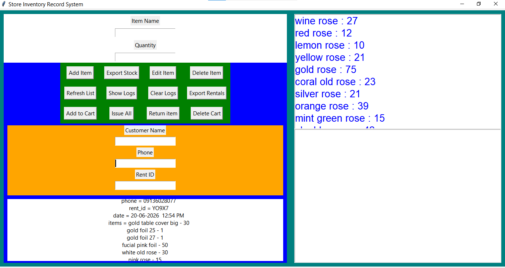

# 📦 Store Inventory Management System


A desktop-based inventory management application built with Python to help manage products, customers, stock, transactions, and reports.

## ✨ Features

* 📦 Add, update, delete, and view products
* 🔍 Search and filter inventory records
* 👥 Manage customer information
* 📊 Track stock and inventory activity
* 🔄 Record stock transactions
* 📑 Generate inventory reports
* 📈 Export reports to Excel
* 💾 Store and manage application data using JSON

## 🛠️ Technologies

* **Python**
* **Tkinter** — Desktop GUI
* **JSON** — Data storage
* **OpenPyXL** — Excel report generation

## 🚀 Getting Started

### Requirements

Make sure you have **Python 3.x** installed.

### Installation

Clone the repository:

```bash
git clone https://github.com/justify-code/store-inventory-management-system.git
```

Open the project folder:

```bash
cd store-inventory-management-system
```

Install the required dependency:

```bash
pip install openpyxl
```

### Run the Application

```bash
python main.py
```

📁 Project Structure
store-inventory-management-system/
│
├── main.py
├── data.json
├── stock.json
├── transactions.json
└── README.md
The exact folders/files may vary depending on the current version of the project.

## 🎯 What I Learned

Building this project helped me practice:

* Python application development
* GUI development with Tkinter
* CRUD operations
* Working with JSON data
* File handling
* Inventory and transaction management
* Excel report generation
* Organizing a multi-feature application

## 🔮 Future Improvements

* Add SQLite or PostgreSQL for database management
* Add user authentication and different user roles
* Improve the dashboard and data visualization
* Add automated testing
* Improve error handling and validation
* Package the application for easier installation

## 👨‍💻 Author

**Justify**

* GitHub: https://github.com/justify-code
* Portfolio: https://justify-portfolio-caa8.up.railway.app/

⭐ Feel free to explore the project and its source code.
